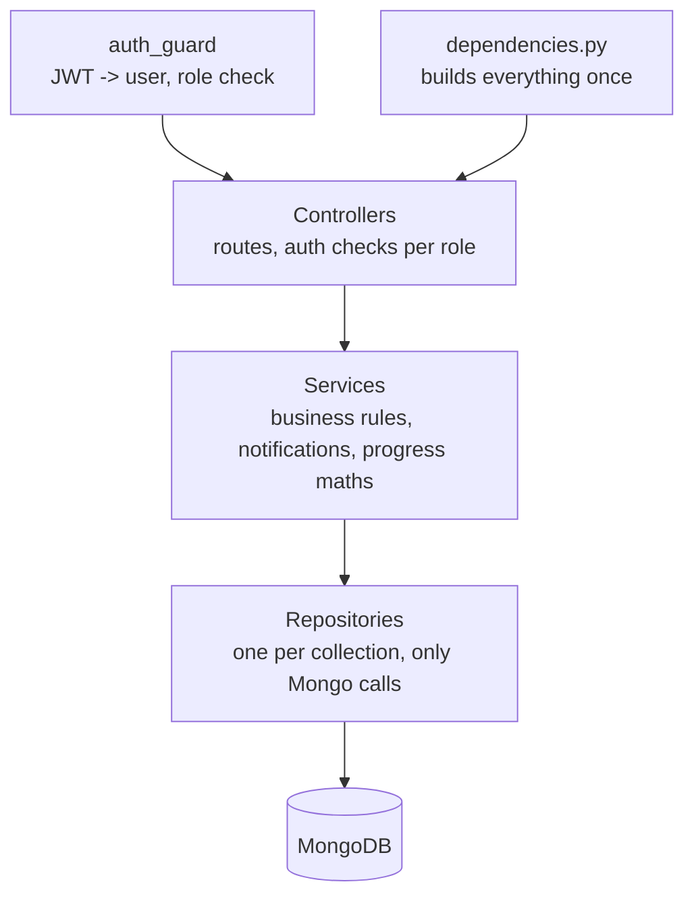
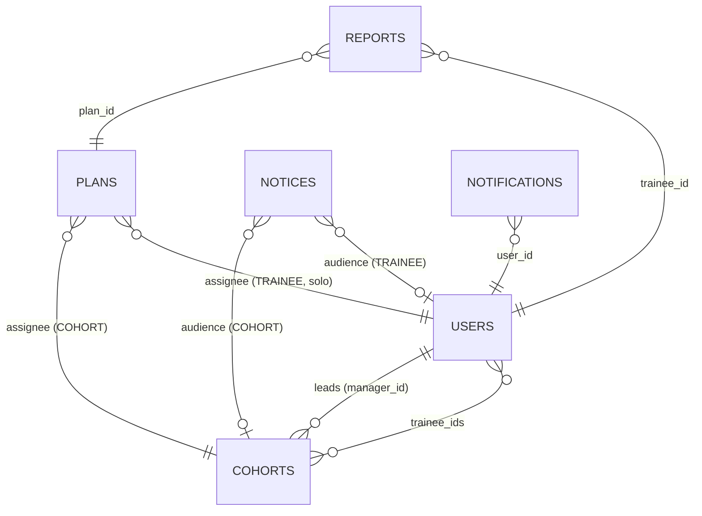

# Architecture

## Deployed (AWS, Version 1: console)

```mermaid
flowchart LR
    U[Browser<br/>HR / Manager / Trainee] -->|HTTPS| S3[Amazon S3<br/>static website<br/>React build]
    U -->|REST + JWT| APIGW[API Gateway<br/>HTTP API<br/>ANY /api/&#123;proxy+&#125;]
    APIGW --> L[AWS Lambda<br/>Python 3.12<br/>FastAPI + Mangum]
    L -->|pymongo, TLS| DB[(MongoDB Atlas<br/>noticeboard db)]
    L -. logs .-> CW[CloudWatch Logs]
```

- The React app is plain static files, so S3 serves it. `VITE_API_URL` is baked in at build time.
- One Lambda serves the whole API. API Gateway forwards every `/api/...` call to it, and FastAPI does the routing, validation and CORS.
- The Mongo client is created once per Lambda container and reused across calls.
- Locally the same code runs with `uvicorn`, and `mongomock://` can stand in for Atlas.

## Backend layers

| Layer | Files | Job |
|---|---|---|
| Controllers | `controllers/*_controller.py` | HTTP routes. Pick the right role guard (`staff`, `hr_only`, `manager_only`, `trainee_only`). No business logic. |
| Services | `services/*_service.py` | Rules: duplicate checks, who can see a plan, report validation, who to notify, dashboard numbers. |
| Progress | `services/progress_service.py` | Pure functions: plan progress, plan state, trainee status. |
| Repositories | `repositories/*_repository.py` | Mongo queries only. |
| Models | `models.py` | Pydantic request bodies and enums. |

## Data model (MongoDB collections)

| Collection | Main fields | Notes |
|---|---|---|
| `users` | name, name_key, email (unique), role, status, track, start_date, password_hash, must_change_password, token_version | `name_key` = lowercased name, used for duplicate checks. Deactivate instead of delete, so history is kept. |
| `cohorts` | name (unique, case-insensitive), manager_id, trainee_ids[], start/end dates | A trainee can be in more than one cohort. |
| `plans` | title, tasks[{id, title, due_date}], assignee_type (COHORT / TRAINEE), assignee_id, status | Task ids stay the same when a plan is edited, so progress is kept. |
| `reports` | trainee_id, plan_id, task_id, status (IN_PROGRESS / DONE / BLOCKED), summary, blockers, hours, feedback, reviewed | A DONE report on a task marks that task complete. |
| `notices` | title, body, priority, audience_type (ALL / COHORT / TRAINEE), audience_id, pinned, read_by[] | `read_by` powers "8 of 12 read". |
| `notifications` | user_id, type, title, message, link, read | Written by services when something happens. The bell polls every 30 s. |

## How the dashboard decides a trainee's status

1. **Unassigned**: no active plan (through a cohort or solo).
2. **Complete**: every task in every plan is done.
3. **Blocked**: the latest report on any plan is BLOCKED.
4. **Not reporting**: no report in `SILENT_DAYS` (7) days, or never reported and the plan is older than 7 days.
5. **Behind**: at least one task is past its due date and not done.
6. **On track**: everything else.

At risk = Blocked + Not reporting + Behind.

## Automated notifications

| Event | Who is notified |
|---|---|
| HR onboards a trainee | the trainee (welcome) |
| Trainee added to a cohort | the trainee |
| Plan created, edited or copied | every active trainee it applies to |
| Notice posted | its audience (priority shows in the title) |
| Progress report sent | the plan's creator and the cohort lead |
| Report marked BLOCKED | same people, as a red "blocked" alert |
| Manager replies with feedback | the trainee |

## Security

- Passwords hashed with bcrypt. Rule: 8+ characters with a letter and a number.
- JWT (HS256, 2 hours). The token carries `token_version`. Changing a password, resetting it, or deactivating the account bumps the version, which signs out old sessions.
- New and reset accounts get a one-time temporary password and must set their own before using the app.
- Role checks on every route. Trainees only see their own plans, reports, cohorts and the notices meant for them.
- Login gives the same message for "no such email" and "wrong password", and is rate limited (10 tries per 15 minutes per email + IP).
- Bad ids return 404, not 500. Validation errors return one readable sentence.
- Secrets (`MONGODB_URI`, `JWT_SECRET`) live in `.env` locally and in Lambda environment variables on AWS, never in Git (`.gitignore` blocks `.env`).
- CORS only allows the origins in `CORS_ORIGINS`.
