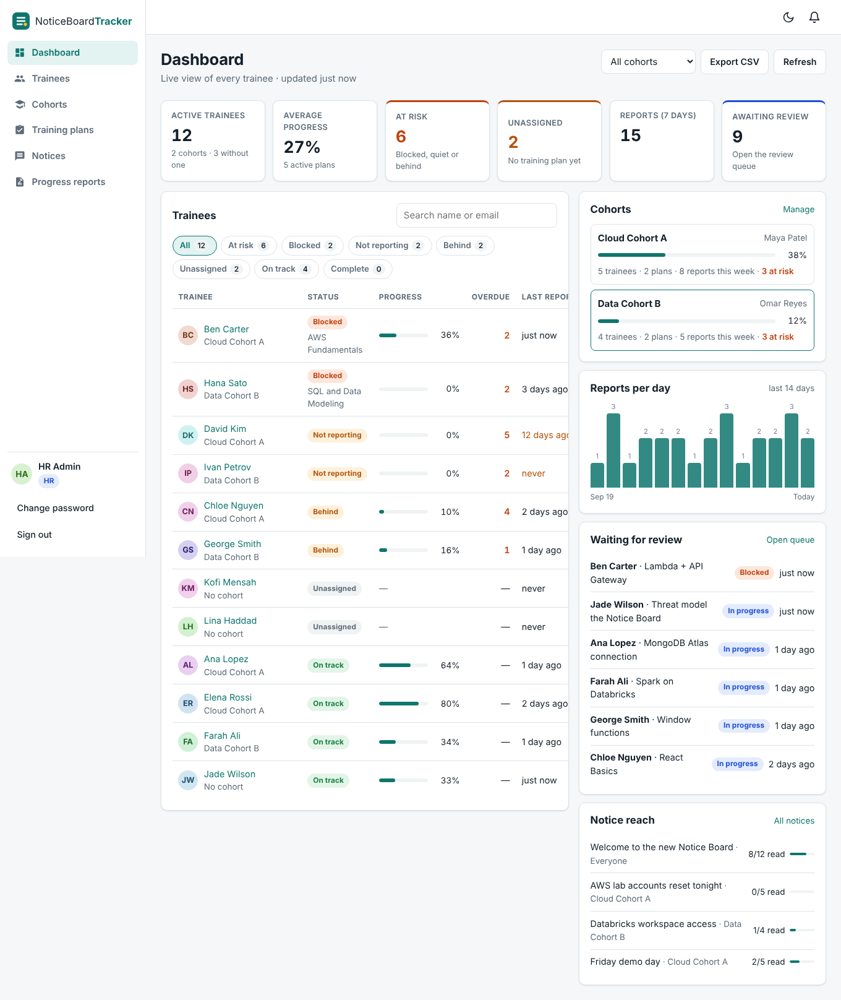
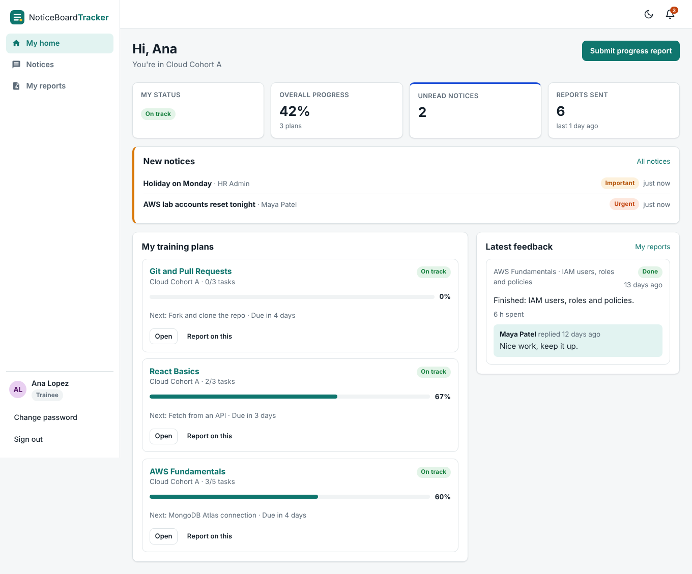
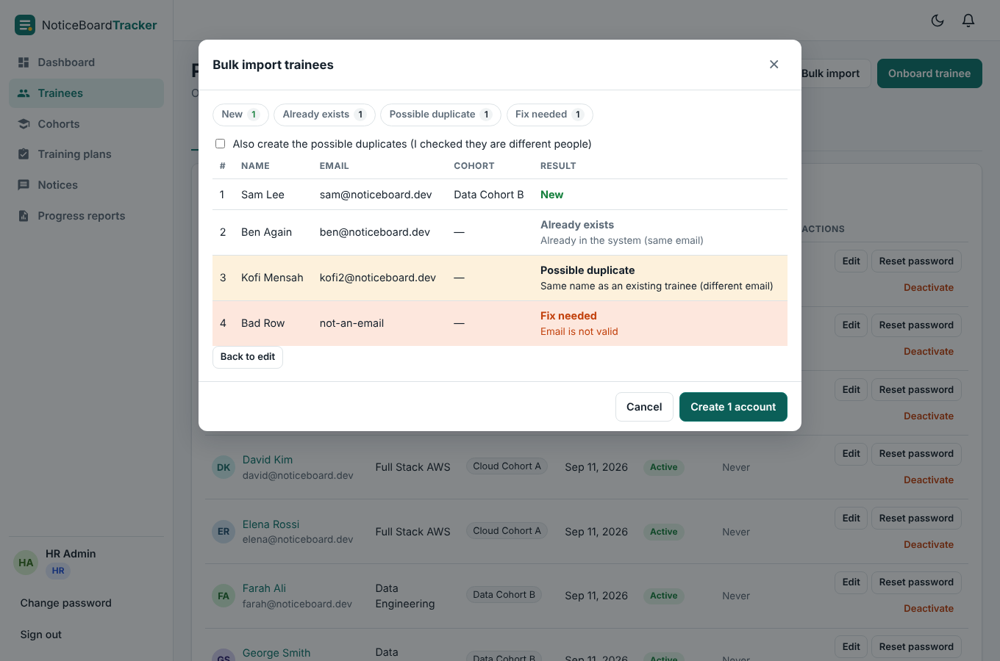
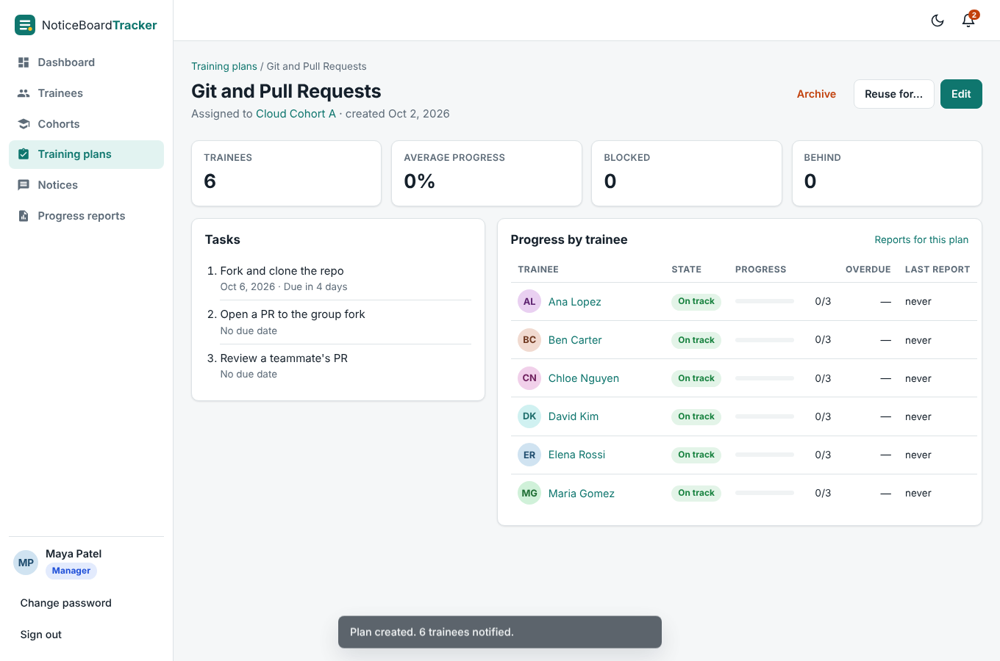

# NoticeBoardTracker (Group 1)

Friday Weekend Challenge, project 02. A full-stack platform that replaces scattered 1:1 messages and the Excel tracking sheet with one place for **onboarding, training plans, notices, progress reports and a manager dashboard**.

| Member | Area |
|---|---|
| Duong Lam | Backend foundation, sign-in, HR onboarding |
| Connor Sheldon | Cohorts, plans, notices, reports, dashboard, tests, Postman |
| Jaden Edwards | React app shell, sign-in and layout |
| Eric Mitchell | HR and manager screens |
| Gabriel Rodriguez | Trainee screens, AWS deploy, docs |

## What it solves

| Pain point (from the brief) | What the app does |
|---|---|
| Scattered 1:1 communication | Notices to everyone, one cohort, or one trainee. Every notice and plan change also lands in each person's notification bell. |
| Error-prone Excel tracking | Bulk import a roster (paste from Excel or upload a CSV) with a preview. Export the live tracker to CSV any time. |
| Untracked / missing trainees, duplicates | Unique email per person. Same-name check on onboarding and import ("Is this the same person?"). A **Possible duplicates** tab. The dashboard flags trainees with **no plan**, **no cohort**, or **no report in 7 days**. |
| Delayed updates, no oversight | Trainees submit progress reports (In progress / Done / Blocked). A blocked report alerts the manager right away. The dashboard shows status, progress, overdue tasks, a review queue, and who has read each notice. |

## Roles

- **HR**: onboards trainees and staff (one by one or bulk), resets passwords, deactivates accounts, sees duplicates.
- **Training Manager**: creates cohorts, assigns training plans to a cohort (or a solo trainee), posts notices, reviews reports and replies with feedback.
- **Trainee**: sees their plans and notices, marks tasks done, reports progress or blockers, reads feedback.

## Stack

- **Frontend**: React 19 + Vite + React Router (no UI library). Light and dark mode, works on phones.
- **Backend**: Python 3.12 + FastAPI, layered (controller -> service -> repository), JWT auth with bcrypt.
- **Database**: MongoDB Atlas. For local work you can use `mongomock://` (in-memory, no Atlas needed).
- **AWS**: S3 static website -> API Gateway (HTTP API) -> Lambda (FastAPI via Mangum) -> MongoDB Atlas. See [Architecture.md](Architecture.md) and [backend/DEPLOY-AWS.md](backend/DEPLOY-AWS.md).

## Run it locally (Windows / PowerShell)

### 1. Backend

```powershell
cd backend
python -m venv .venv
.venv\Scripts\Activate.ps1
pip install -r requirements-dev.txt
copy .env.example .env      # defaults: in-memory database + demo data
python -m uvicorn main:app --reload
```

API: http://127.0.0.1:8000 and Swagger: http://127.0.0.1:8000/docs

To use Atlas instead, set `MONGODB_URI` in `backend/.env` to your `mongodb+srv://...` string, then run `python seed_demo.py` once for the demo data.

### 2. Frontend (second terminal)

```powershell
cd frontend
npm install
npm run dev
```

Open http://localhost:5173. The login page has demo buttons (local only).

### Demo logins

| Role | Email | Password |
|---|---|---|
| HR | hr@noticeboard.dev | hrAdmin123 (from `BOOTSTRAP_HR_PASSWORD`) |
| Manager | manager@noticeboard.dev (Maya Patel) | Demo1234 |
| Manager | omar@noticeboard.dev (Omar Reyes) | Demo1234 |
| Trainee | ana@noticeboard.dev, ben@..., chloe@... | Demo1234 |

The demo data covers every dashboard state: on track, behind, blocked, not reporting, unassigned, and a solo track.

## Tests

| What | How | Result |
|---|---|---|
| API tests (pytest, every role) | `cd backend` then `python -m pytest -q` | 18 passed |
| Postman collection | Import `postman/NoticeBoardTracker.postman_collection.json`, run the folders in order | 59 requests, 107 assertions, 0 failed |
| Browser walkthrough (Playwright) | HR, Manager, new Trainee, Trainee, phone + dark mode | 29/29 passed, 0 console errors |
| Lambda package | `python build_lambda.py`, then called with API Gateway v2 events on Python 3.12 | health, login, CORS preflight, gzip OK |

## Main API routes

| Area | Routes |
|---|---|
| Auth | `POST /api/auth/login`, `GET /api/auth/me`, `POST /api/auth/change-password` |
| People (HR) | `GET/POST /api/users`, `PATCH /api/users/{id}`, `POST /api/users/{id}/deactivate`, `/reactivate`, `/reset-password`, `POST /api/users/import/preview`, `POST /api/users/import`, `GET /api/users/duplicates` |
| Cohorts | `GET/POST /api/cohorts`, `GET/PATCH/DELETE /api/cohorts/{id}`, `POST /api/cohorts/{id}/members`, `DELETE /api/cohorts/{id}/members/{traineeId}` |
| Plans | `GET/POST /api/plans`, `GET/PATCH /api/plans/{id}`, `POST /api/plans/{id}/archive`, `/restore`, `/copy` |
| Notices | `GET/POST /api/notices`, `GET/PATCH/DELETE /api/notices/{id}`, `POST /api/notices/{id}/read` |
| Reports | `GET/POST /api/reports`, `POST /api/reports/{id}/feedback`, `POST /api/reports/{id}/reviewed` |
| Dashboard | `GET /api/dashboard[?cohort_id=]`, `GET /api/dashboard/trainees/{id}`, `GET /api/me/overview` |
| Notifications | `GET /api/notifications[?unread=true]`, `POST /api/notifications/{id}/read`, `POST /api/notifications/read-all` |

Full request/response shapes are in Swagger (`/docs`).

## Folder layout

```
Group1_Member1_Member2_Member3_Member4/
├── backend/        FastAPI app, tests, seed data, Lambda builder, AWS guide
├── frontend/       React app (Vite)
├── postman/        Postman collection
├── screenshots/    UI screenshots
├── Architecture.md
└── ReadMe.md
```

## Screenshots

| Manager dashboard | Trainee home |
|---|---|
|  |  |
| **Bulk import with duplicate checks** | **Plan progress by trainee** |
|  |  |
