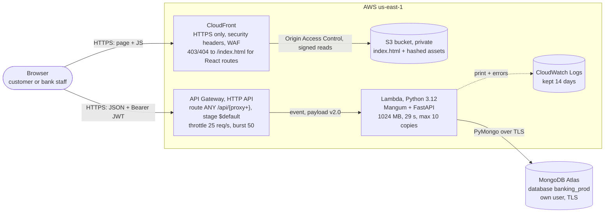
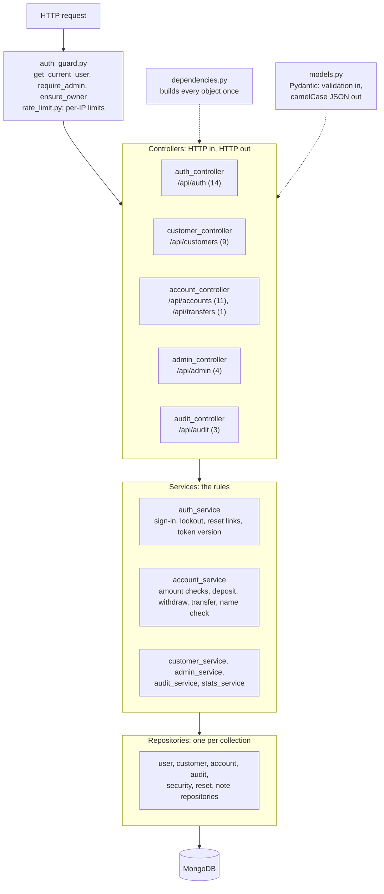
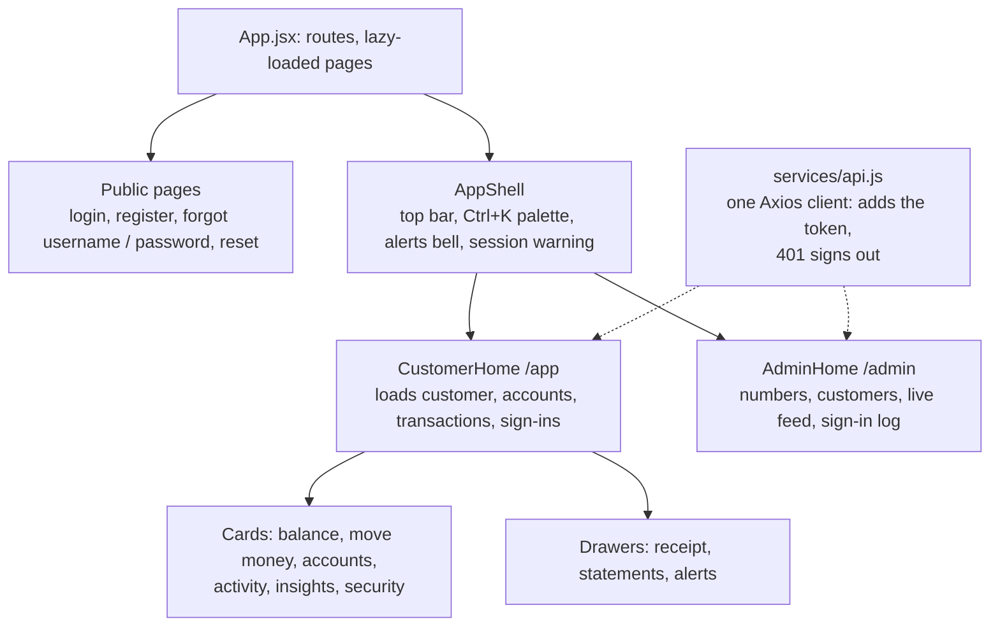
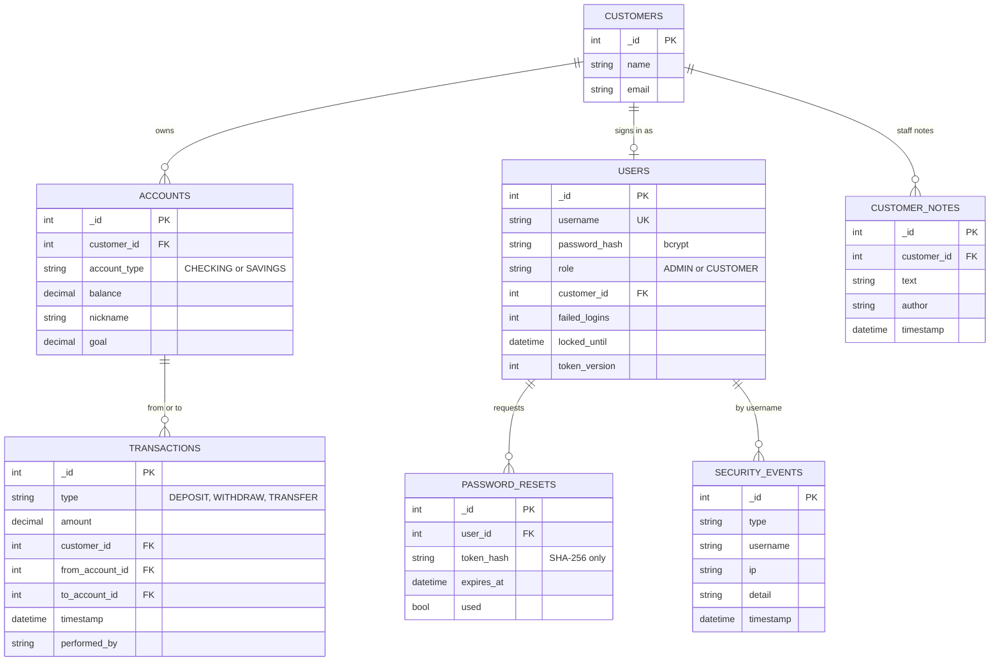
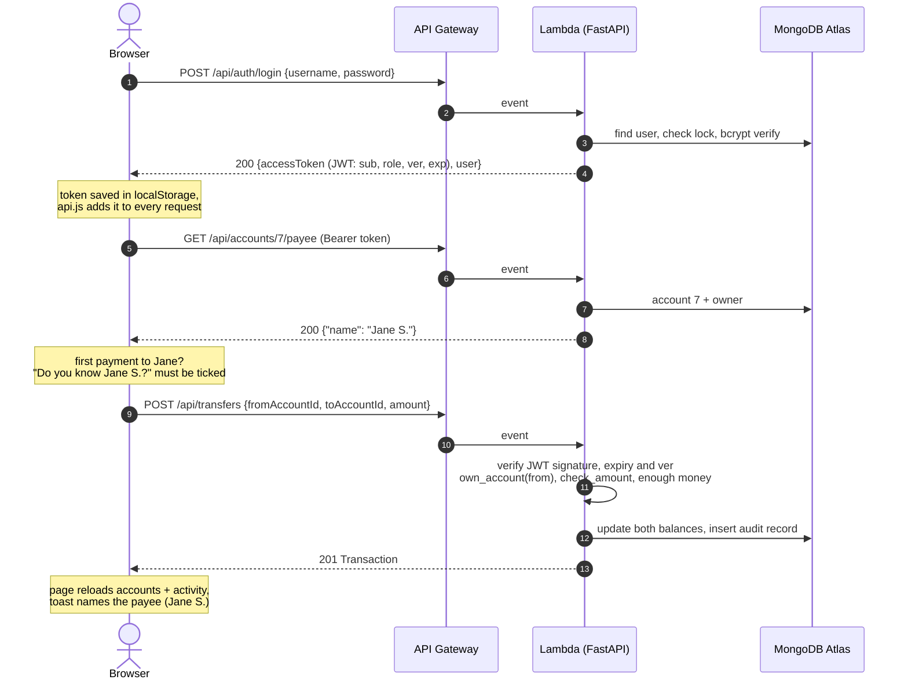
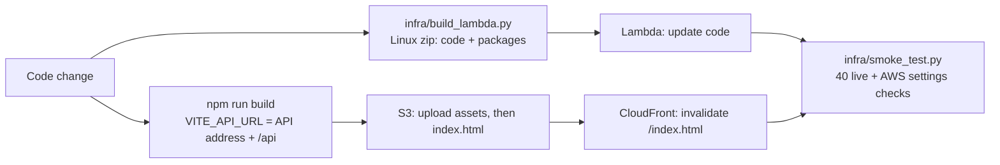

# Simple Bank: Architecture

A full-stack online bank: a **React** single-page app, a **FastAPI** REST API built in layers (controller, service,
repository), and **MongoDB Atlas** for data. It runs on AWS as a serverless stack: **CloudFront + S3** for the website,
**API Gateway + Lambda** for the API.

Live: https://d2q7afhbbrmnob.cloudfront.net

## 1. Deployed system

| Piece | What it does | Key settings |
|---|---|---|
| **CloudFront** | Serves the React app over HTTPS from edge locations | Redirect HTTP to HTTPS; default root `index.html`; errors 403/404 return `/index.html` with 200 so refreshing `/app` works; managed SecurityHeadersPolicy (HSTS, nosniff, frame options, referrer policy); WAF |
| **S3** | Holds the built site (`npm run build` output) | All public access blocked; only this distribution can read it (OAC bucket policy); `index.html` sent with `no-cache`, hashed assets cached for a year |
| **API Gateway** | Public HTTPS address of the API | HTTP API (cheaper and simpler than REST API); one catch-all route so FastAPI does the real routing; no `/prod` prefix; CORS left to FastAPI |
| **Lambda** | Runs the whole FastAPI app | `backend/lambda_handler.py` wraps the app with Mangum; startup (indexes, admin login) runs once per cold start; reserved concurrency 10 caps cost and database connections |
| **MongoDB Atlas** | All data | Separate database (`banking_prod`) and a database user that can only read and write it |
| **CloudWatch** | Logs | Every request's REPORT line, errors, and the "emails" the demo prints instead of sending |

All AWS resources carry the course tags `workshop=full-stack`, `date=02-Oct-2026`, `autodelete=false`, `owner=duong-lam`.

## 2. Backend: three layers

- **Controllers** translate HTTP into method calls and check who is asking. **Services** hold every business rule
  (amount above $0, at most 2 decimals, max $1,000,000, enough money, lockout after 5 wrong passwords).
  **Repositories** only read and write MongoDB.
- **Money** is `Decimal` in Python and `Decimal128` in MongoDB (a codec in `db.py`), never a float on the server.
- **IDs** are integers from a `counters` collection (atomic `$inc`), like `AUTO_INCREMENT` in SQL.
- The same app runs three ways: `uvicorn` on a PC, Docker (`docker-compose.yml`), and Lambda (`lambda_handler.py`).

## 3. Frontend

- One page per role owns the state; cards get data as props and report back with callbacks; after any money move the
  page reloads accounts and transactions.
- `AuthContext` holds the signed-in user; the JWT lives in `localStorage`; `ProtectedRoute` keeps each role on its page
  (the server enforces roles regardless).
- Charts, alerts and monthly statements are worked out in the browser from the loaded transactions.

## 4. Data model (MongoDB collections)

Plus `counters` (`_id` = collection name, `seq` = last id). `transactions` and `security_events` are add-only: nothing
updates or deletes them, so they work as an audit trail. Deleting a customer removes their accounts and login, never
their history.

## 5. One request end to end: sign in, then send money

## 6. Security

| Concern | How it's handled | Where |
|---|---|---|
| Passwords | bcrypt with salt; never returned by the API | `security.py`, `models.py` (`User` has no hash) |
| Sessions | JWT signed with `JWT_SECRET` (HS256), 60-minute expiry, "Stay signed in" refresh | `security.py`, `auth_service.py` |
| Sign out everywhere | `token_version` per user, copied into each token as `ver`, checked on every request | `auth_guard.py` |
| Who can do what | 401 without a valid token; 403 for non-admins on staff routes and for other people's accounts | `auth_guard.py`, `account_controller.py` |
| Password guessing | 5 wrong passwords lock the login for 15 minutes; staff can unlock | `auth_service.py` |
| Flooding | Per-IP limits on forgot / reset / name check; API Gateway throttling; Lambda concurrency cap | `rate_limit.py`, AWS |
| Reset links | 256-bit random token, only its SHA-256 stored, 15 minutes, single use; same answer whether the account exists or not | `auth_service.py`, `reset_repository.py` |
| Browser rules | CORS allows only the CloudFront site; security headers on the site and the API | `main.py`, CloudFront |
| Transport and storage | HTTPS everywhere; private S3 bucket behind OAC; Atlas over TLS | AWS, Atlas |
| Secrets | `MONGODB_URI`, `JWT_SECRET`, `ADMIN_PASSWORD` live in Lambda settings and a git-ignored `.env`, never in the code | `.gitignore` |

## 7. Build, deploy and test

- **By hand:** `infra/CONSOLE.md`, the AWS console click-through this deployment was built with.
- **One command each side:** `infra/console/redeploy_api.ps1` and `infra/console/redeploy_site.ps1`.
- **CI/CD:** `.github/workflows/ci-cd.yml` checks every push (imports, builds, Terraform validate) and, once the repo's
  AWS variables are set, deploys `main` to the Lambda and S3.
- **Infrastructure as code** (same app, alternative setups): `infra/` (Terraform: S3 website + Lambda + API Gateway)
  and `infra-ec2/` (Docker on EC2 behind CloudFront).
- **Tests:** Postman collection (83 requests, 151 assertions), Playwright browser suite (131 + 8 checks), the
  smoke test, and QA notes in `infra/QA.md`.

## 8. Design decisions

| Decision | Why | Trade-off |
|---|---|---|
| One Lambda for the whole API (Mangum) | The unchanged FastAPI app runs locally and on AWS; one thing to deploy | Cold start of about 2 to 3 s after a quiet spell |
| HTTP API, not REST API | Cheaper, faster, simpler; `$default` stage keeps paths identical to local | Fewer features (no usage plans or API keys) |
| CloudFront in front of a private bucket | HTTPS, caching, security headers, bucket not public | More setup than S3 website hosting |
| MongoDB Atlas | Free tier, managed, reachable from Lambda without a VPC | Lambda has no fixed IP, so Atlas allows any IP (the password still protects it) |
| Integer ids from `counters` | Matches the assignment's SQL schema and readable account numbers | Guessable ids, which is why every account route checks ownership |
| Charts, alerts, statements computed in the browser | No extra endpoints; the page already has the data | Needs server-side paging for very long histories |

Known limits and next steps (atomic balance updates and multi-document transactions for transfers, idempotency keys,
httpOnly cookies, alarms): `infra/QA.md`.
